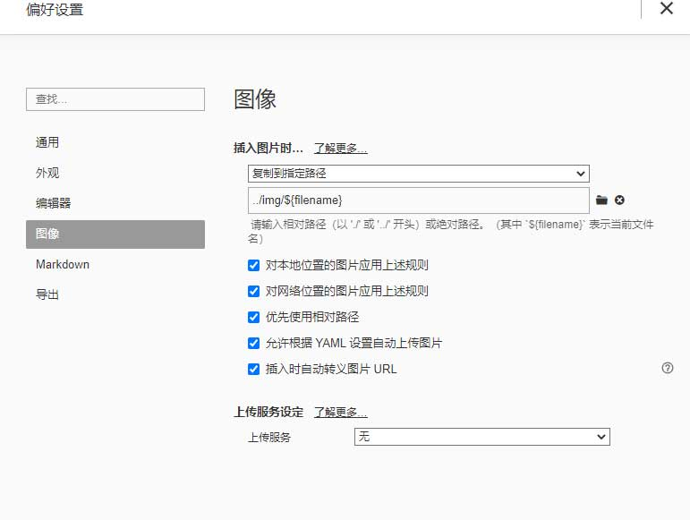
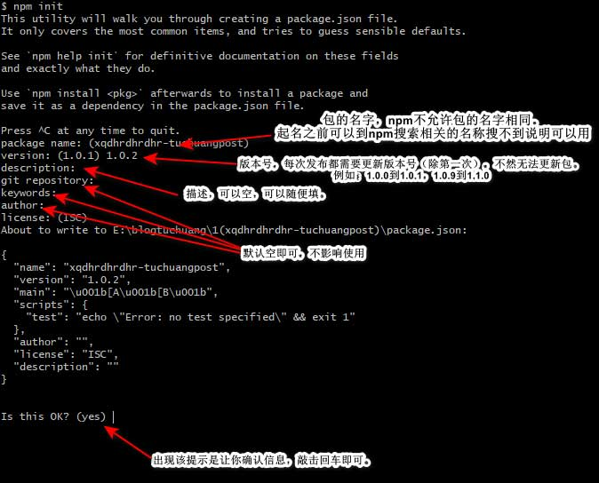
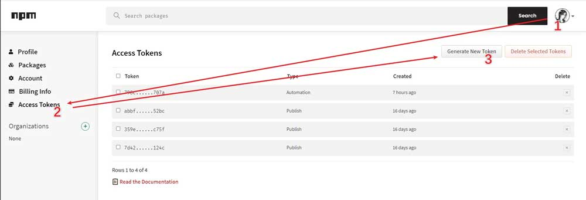

>2022.5.17 因为`jsdelivr`不再稳定，此法已失效。现在还是利用`typecho`将插入到文章的图片自动复制到`/source/img/`文件夹下，方法如下:
>
>1.在`typora`菜单栏点击 `格式->图像->设置图片根目录`，将`hexo/source`作为其根目录即可。
>
>2.首先在 hexo > source目录下建一个文件夹叫img，用来保存博客中的图片。然后打开Typora的 文件 > 偏好设置，进行如下设置。
>
>
>
>```
>复制到制定路径
>../img/${filename}
>勾选所有选项：
>对本地位置的图片应用上述规则
>对网络位置的图片应用上述规则
>优先使用相对路径
>允许根据YAML设置自动上传图片
>插入时自动转义图片URL
>```
>
>这样的话所有插入到md的图片都将会保存到 `/source/img/该博客md文件名/图片名称`。
>
>PS： [Butterfly](https://github.com/jerryc127/hexo-theme-butterfly)主题相册：
>
>```
>
>
>
>
>
>
>
>
>
>
>
>
>
>
>
>```
>
>```
><style>
>.page-title {
>    display: none;
>  }
></style>
>## 骑行
>
><div class="gallery-group-main">
>
></div>
>
>
>## 太和小学2019级
>
><div class="gallery-group-main">
>
>
>
>
></div>
>
>
>## 湖大教技2010级
>
><div class="gallery-group-main">
>
>
></div>
>```
>
>手动将图片文件夹放到上述文件夹下，然后在源码模式，一个个输入图片相对路径。

## 配置github

### 新建公共仓库  

新建一个公共仓库，例如我建的仓库地址：`https://github.com/iwyang/pic`，注意一定要勾选**使用Readme文件初始化这个仓库**，否则后面会无法上传图片。

### 获取私人令牌

[前往设置](https://github.com/settings/tokens)，作用：授权仓库的操作权限，通过API实现自动化。然后填写 `Token` 描述，勾选 repo、write、read然后点击 `Generate token` 生成一个 `Token`。因为 Token 只会显示一次，所以先保存笔记本等。

## 安装&配置PicGo

### 安装PicGo

访问[PicGo Releases](https://github.com/Molunerfinn/PicGo/releases)直接下载你的操作系统对应的安装包并完成安装。

> 注：在安装的时候安装目录千万不能选C:\Program Files\下的任何地方，因为PicGo无法解析这一路径，如果你不知道安装在哪里的话，选择仅为我安装，否则在设置Typora时会出现错误。

### 配置PicGo

在PicGo设置里作如下修改：

```bash

设置日志文件：日志记录等级选择"错误-Error"和"提醒-Warn"
时间戳重命名：开
开启上传提示：开
上传后自动复制URL：开
选择显示的图床：只勾选Github图床
```

### 配置`GitHub`插件

安装好后开始配置`GitHub`图床

1. 设定仓库名：按照 用户名/仓库名 的格式填写（iwyang/pic）
2. 设定分支名：master
3. 设定 Token：粘贴之前叫你保存的Token。（在网盘里搜索`图床`会找到Token）
4. 设定自定义域名：它的的作用是，在图片上传后，PicGo 会按照自定义域名+上传的图片名的方式生成访问链接，放到粘贴板上。 `https://cdn.jsdelivr.net/gh/用户名/仓库名`（`https://cdn.jsdelivr.net/gh/iwyang/pic`）


5. 点击`设为默认图床`

### 上传和管理图片

- 单击上传区，选择链接格式，使用点击上传或剪贴板图片上传，PicGo会自动上传图片并将符合链接格式的链接复制到剪贴板，你只要按下Ctrl+v即可粘贴图片的链接。
- 单击相册，你可以看到你上传的所有图片，你可以对所有图片进行复制链接，修改图片URL与删除操作，并可以批量复制或批量删除。

## 配置Typora

- 点击Typora左上角的文件->偏好设置
- 在弹出的界面中点击图像，选择插入图片时选项为`上传图片`，并勾选`对本地位置的图片应用上述规则`和`对网络位置的图片应用上述规则`。
- `上传服务`选项里选择`PicGo(app)`，`PicGo路径`选择`PicGo.exe`的绝对路径。

以后在Typora里插入本地图片时，它会利用PicGo自动帮你上传到github，并替换本地图片地址为github地址。

## Typora下载地址&皮肤

下载地址：

+ [Typora 1.3.8](https://www.ghxi.com/typora.html)
+ [123pan](http://www.123pan.com/s/HQeA-UX1Sh)

皮肤：

+ [DrakeTyporaTheme](https://github.com/liangjingkanji/DrakeTyporaTheme)

## npm图床

1.首先需要注册一个 npm 的账号。访问 [npm 注册页面](https://www.npmjs.com/signup/)

2.完成邮箱验证，注册完成后进入账号管理界面:头像 ->Account，拉倒最上方，你会看到 `You have not verified your email address` 字样的提示，点击以后按提示步骤验证你的邮箱。

3.部分同学需要切换回原生源，如果你没改过源请跳过此步。（右键空白处———Git bush）来打开终端，输入以下命令：

```
npm config set registry https://registry.npmjs.org
```

4.添加本地 `npm` 用户设置

```
# 仅第一次使用需要添加用户，之后会提示你输入你的npm账号密码以及注册邮箱(第一次可能需要输入邮箱验证码)
npm adduser
# 非第一次使用直接登录即可，之后会提示你输入你的npm账号密码以及注册邮箱(第一次可能需要输入邮箱验证码)
npm login
```

5.新建一个文件夹，将你需要的上传到图床的图片放到里面。也可以将你之前的GitHub仓库的图片clone下来，右键文件夹空白处打开终端。输入以下命令：

```
npm init
```
运行 `npm` 初始化指令，把整个图床仓库打包，按照指示进行配置，注意需要事先确认你的包名没有和别人已发布的包重复，可以在 npm 官网搜索相应包名，搜不到就说明还没被占用。



6.禁用双重验证

如果不禁用双重验证，每次`npm publish`都会报错提示要输入验证码（必须加上`--otp=<code>`才能发布包）：

```
npm ERR! You can provide a one-time password by passing --otp=<code> to the command you ran.
```

**禁用方法：**

```bash
npm profile disable-2fa
```

npm 将提示你输入密码，然后npm会显示`Enter one-time password from your authenticator:6位数字`。

7.然后输入以下指令来发布我们的包：：

```
npm publish
```

8.那么如何利用~~国内~~节点引用图片等资源呢


```
https://unpkg.com/:package@:version/:file                  ## unpkg CDN 
https://cdn.jsdelivr.net/npm/:package@:version/:file       ## jsd cdn
https://cdn1.tianli0.top/npm/:package@:version/:file       ## 第三方
```

例如：

```
https://unpkg.com/iwyang@1.0.2/speak/butterfly-ispeak-swiper.min.js
https://cdn.jsdelivr.net/npm/iwyang@1.0.2/speak/butterfly-ispeak-swiper.min.js
https://cdn1.tianli0.top/npm/iwyang@1.0.2/speak/butterfly-ispeak-swiper.min.js
```

> 通过ping看出，`unpkg`比`jsd`要稳定、速度要更快，所以优先使用`unpkg`


9.每次更新 npm 图床都需要先修改`[AssetsRepo]\package.json`里的 `version`, 也就是版本号。
而 `npm version patch` 即为更新 package.json 里的版本号的指令，效果是末尾版本号 + 1，例如 `0.0.1=>0.0.2`、`1.1.3=>1.1.4`。免去了打开 `package.json` 再修改版本号的麻烦。（大版本更新还是需要手动改的）。更新 npm 图床务必要记得更新 `package.json` 里的版本号！

```
npm version patch
```

10.可以在根目录新建 `deploy.sh`脚本：

```
# 更新package版本号
npm version patch
# 发布新版本包
npm publish
```

### 利用GitHub actions发布包

> 此部分内容还未测试


1.如果每次都要在本地进行 npm publish 的话，npm 的提交是整个包一起上传的，不存在增量更新，耗时不说，而且还往往需要架梯子才能正常上传。所以我们可以把它交给 github action 来完成。

在 [npm 官网](https://www.npmjs.com/) ->`头像` ->`Access Tokens`->`Generate New Token`, 勾选`Automation`选项，`Token` 只会显示这一次，之后如果忘记了就只能重新生成重新配置了。




2.在 github 的 `[AssetsRepo]` 仓库设置项里添加一个名为 `NPM_TOKEN` 的 `secrets`，把获取的 Npm 的`Access token`输入进去。


3.在本地的 `[AssetsRepo]`文件夹下新建 `[AssetsRepo]/.github/workflows/autopublish.yml`

```yaml
name: Node.js Package
# 监测图床分支，2020年10月后github新建仓库默认分支改为main，记得更改
on:
  push:
    branches:
      - master

jobs:
  publish-npm:
    runs-on: ubuntu-latest
    steps:
      - uses: actions/checkout@v2
      - uses: actions/setup-node@v1
        with:
          node-version: "12.x"
          registry-url: https://registry.npmjs.org/
      - run: npm publish
        env:
          NODE_AUTH_TOKEN: ${{secrets.npm_token}}
```

4.在本地的 `[AssetsRepo]` 文件夹下打开终端，运行以下指令，上传新增内容至 github，即可触发部署。

```bash
# 将更改提交
git add .
git commit -m "npm publish"
# 更新package版本号
npm version patch
# 推送至github触发action
git push
```

> 此处的四行指令顺序严格。
> 每次更新 npm 图床都需要先修改`[AssetsRepo]\package.json`里的 `version`, 也就是版本号。
> 而 `npm version patch` 即为更新 package.json 里的版本号的指令，效果是末尾版本号 + 1，例如 `0.0.1=>0.0.2`、`1.1.3=>1.1.4`。免去了打开 `package.json` 再修改版本号的麻烦。（大版本更新还是需要手动改的）
> 更新 npm 图床务必要记得更新 `package.json` 里的版本号！


5.总结：

+ GitHub 图床仓库大小不能超过 1G。当仓库超过 1G 后会有人工审核仓库内容，如果发现用来做图床，轻则删库重则封号。
+ Npm 有 `100MB` 的包大小限制，但是 NPM 有丰富的国内节点。

## 参考链接

+ [1.GitHub + jsDelivr + PicGo 打造稳定快速、高效免费图床](https://my.oschina.net/u/3990666/blog/4371252)
+ [2.手把手教你用Typora自动上传到picgo图床](https://blog.csdn.net/disILLL/article/details/104944710)
+ [3.typora + hexo博客中插入图片](https://yinyoupoet.github.io/2019/09/03/hexo%E5%8D%9A%E5%AE%A2%E4%B8%AD%E6%8F%92%E5%85%A5%E5%9B%BE%E7%89%87/)
+ [4.使用npm作为图床](https://minecraftbilibili.com/posts/950569f3)
+ [5.npm图床的使用技巧](https://sianx.com/posts/3e956346/)
+ [6.npm 使用双因素身份验证.](https://www.w3cschool.cn/npmjs/npmjs-qadz3kmo.html)

