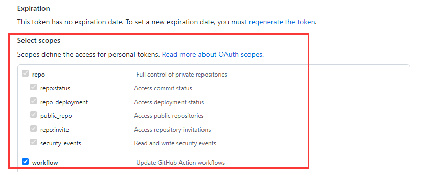

## 自动同步Fork（现在用的）

**参考chatgpt**:

在你的 fork 仓库中新建：

```yaml
.github/workflows/sync.yml
```

内容如下（可直接复制）：

```yaml
name: Sync Upstream

on:
  schedule:
    - cron: '0 0 * * *'   # 每天自动同步一次
  workflow_dispatch:       # 手动触发按钮  
  watch:
    types: started

jobs:
  sync:
    runs-on: ubuntu-latest
    steps:
      - name: Checkout
        uses: actions/checkout@v3
        with:
          fetch-depth: 0

      - name: Add upstream
        run: |
          git remote add upstream https://github.com/上游用户名/上游仓库.git
          git fetch upstream

      - name: Configure Git
        run: |
          git config user.name "github-actions[bot]"
          git config user.email "github-actions[bot]@users.noreply.github.com"

      - name: Merge upstream
        run: |
          git merge upstream/main --allow-unrelated-histories || true

      - name: Push
        run: |
          git push origin main
```

你需要修改两处:

1.把：

```
https://github.com/上游用户名/上游仓库.git
```

替换成你要同步的上游仓库地址。

2.如果上游主分支不是 `main`（例如是 `master`），你要改：

```
upstream/main
```

为：

```
upstream/master
```

最终为：

```yaml
name: Sync Upstream

on:
  schedule:
    - cron: '0 0 * * *'   # 每天自动同步一次
  workflow_dispatch:       # 手动触发按钮  
  watch:
    types: started

jobs:
  sync:
    runs-on: ubuntu-latest
    steps:
      - name: Checkout
        uses: actions/checkout@v3
        with:
          fetch-depth: 0

      - name: Add upstream
        run: |
          git remote add upstream https://github.com/上游用户名/上游仓库.git
          git fetch upstream

      - name: Configure Git
        run: |
          git config user.name "github-actions[bot]"
          git config user.email "github-actions[bot]@users.noreply.github.com"

      - name: Merge upstream
        run: |
          git merge upstream/master --allow-unrelated-histories || true

      - name: Push
        run: |
          git push origin master
```

完成后：

- 每天凌晨自动同步上游更新
- 你也可以在 Actions 页面手动点击“Run workflow”
- 不需要手动处理冲突（脚本里 `|| true` 自动跳过错误）

## 自动同步Fork（以前用的）

创建新的workflow，在仓库右上角点`Add file`，先输入`workflows`文件夹名，再点击空白位置，自动进入下一目录，然后输入文件名`sync.yml`。接着

在`sync.yml`输入里面的内容：

```yaml
name: Upstream Sync

permissions:
  contents: write

on:
  schedule:
    - cron: "0 0 * * *" # every day
  workflow_dispatch:

jobs:
  sync_latest_from_upstream:
    name: Sync latest commits from upstream repo
    runs-on: ubuntu-latest
    if: ${{ github.event.repository.fork }}

    steps:
      # Step 1: run a standard checkout action
      - name: Checkout target repo
        uses: actions/checkout@v3

      # Step 2: run the sync action
      - name: Sync upstream changes
        id: sync
        uses: aormsby/Fork-Sync-With-Upstream-action@v3.4
        with:
          upstream_sync_repo: ChatGPTNextWeb/ChatGPT-Next-Web
          upstream_sync_branch: main
          target_sync_branch: main
          target_repo_token: ${{ secrets.GITHUB_TOKEN }} # automatically generated, no need to set

          # Set test_mode true to run tests instead of the true action!!
          test_mode: false

      - name: Sync check
        if: failure()
        run: |
          echo "[Error] 由于上游仓库的 workflow 文件变更，导致 GitHub 自动暂停了本次自动更新，你需要手动 Sync Fork 一次，详细教程请查看：https://github.com/Yidadaa/ChatGPT-Next-Web/blob/main/README_CN.md#%E6%89%93%E5%BC%80%E8%87%AA%E5%8A%A8%E6%9B%B4%E6%96%B0"
          echo "[Error] Due to a change in the workflow file of the upstream repository, GitHub has automatically suspended the scheduled automatic update. You need to manually sync your fork. Please refer to the detailed tutorial for instructions: https://github.com/Yidadaa/ChatGPT-Next-Web#enable-automatic-updates"
          exit 1
```

## 自动同步Fork（以以前用的）

虽然Github自带一个Sync Fork的按钮，但是每次都自己点总是麻烦的，所以有人搞了个Github Action来做这件事，https://github.com/tgymnich/fork-sync

### 创建workflow

创建新的workflow，在仓库右上角点`Add file`，先输入`workflows`文件夹名，再点击空白位置，自动进入下一目录，然后输入文件名`sync.yml`。接着

在`sync.yml`输入里面的内容：

**官方：**

```yaml
name: Sync Fork

on:
  schedule:
    - cron: '*/30 * * * *' # every 30 minutes
  workflow_dispatch: # on button click

jobs:
  sync:

    runs-on: ubuntu-latest

    steps:
      - uses: tgymnich/fork-sync@v2.0
        with:
          token: ${{ secrets.PERSONAL_TOKEN }}
          owner: llvm
          base: master
          head: master
```

**注释：**

```yaml
name: Sync Fork

on:
  push: # push 时触发, 主要是为了测试配置有没有问题
  schedule:
    - cron: '* */24 * * *' # 每天一次
jobs:
  repo-sync:
    runs-on: ubuntu-latest
    steps:
      - uses: tgymnich/fork-sync@v2.0
        with:
          token: ${{ secrets.TOKEN }} #Github Token，记得加入secrets
          owner: ngosang # fork 的上游仓库 user
          head: master # fork 的上游仓库 branch
          base: master # 本地仓库 branch
```

**最终**`sync.yml`

```yaml
name: Sync Fork

on:
  schedule:
    - cron: '* */24 * * *' # 每天一次
  workflow_dispatch: # on button click

jobs:
  sync:

    runs-on: ubuntu-latest

    steps:
      - uses: tgymnich/fork-sync@v2.0
        with:
          token: ${{ secrets.PERSONAL_TOKEN }}
          owner: mack-a
          base: master
          head: master
```

`* */24 * * *`改成`* */48 * * *`每两天运行一次

> PS：ChatGPT有时给出的答案可能是错误的，需要验证：[crontab guru](https://crontab.guru/)

### 创建github访问token

参考：[管理个人访问令牌](https://docs.github.com/zh/authentication/keeping-your-account-and-data-secure/managing-your-personal-access-tokens)

1.在任何页面的右上角，单击个人资料照片，然后单击“设置”。

2.在左侧边栏中，单击“ 开发人员设置”。
3.请在左侧边栏的“ Personal access token”下，单击“细粒度令牌” 。
4.单击“生成新令牌”。
5.在“令牌名称”下，输入令牌的名称。
6.在“过期时间”下，选择令牌的过期时间（永不过期）。

7.然后权限要开启**repo**和**workflow**的权限



8.创建完成后复制token内容

### 添加环境变量secret

在`settings/secrets(Secrets and variables)/actions`里把Github的Token设置上，比如workflow写的是secrets.PERSONAL_TOKEN，所以添加的时候Name填写PERSONAL_TOKEN，Secret里填写上一步创建Token内容。

如果部署完成之后，运行显示错误是：

> repo-sync
> Failed to create or merge pull request: HttpError: Validation Failed: {“resource”:”PullRequest”,”code”:”custom”,”message”:”No commits between knight000:master and ngosang:master”}

就证明初步成功了，因为你部署了workflow所以比原仓库新，等原仓库更新后点`Re-run jobs`就可以测试是否正确部署了。

### 自动提交修改到Gitee(未测试)

以下action文件来自https://juejin.cn/post/6894928345830522887

把GITEE_PRIVATE_KEY、[GITEE_TOKEN](https://gitee.com/profile/personal_access_tokens)、GITEE_USER都添加到secrets里，然后Gitee内[从URL导入仓库](https://gitee.com/projects/import/url)，创建同名仓库即可同步。

```yaml
# 通过 Github actions， 在 Github 仓库的每一次 commit 后自动同步到 Gitee 上
name: sync2gitee
on:
  push:
    branches:
      - master
jobs:
  repo-sync:
    env:
      dst_key: ${{ secrets.GITEE_PRIVATE_KEY }}
      dst_token: ${{ secrets.GITEE_TOKEN }}
      gitee_user: ${{ secrets.GITEE_USER }}
    runs-on: ubuntu-latest
    steps:
      - uses: actions/checkout@v2
        with:
          persist-credentials: false

      - name: sync github -> gitee
        uses: Yikun/hub-mirror-action@master
        if: env.dst_key && env.dst_token && env.gitee_user
        with:
          # 必选，需要同步的 Github 用户（源）
          src: 'github/${{ github.repository_owner }}'
          # 必选，需要同步到的 Gitee 用户（目的）
          dst: 'gitee/${{ secrets.GITEE_USER }}'
          # 必选，Gitee公钥对应的私钥，https://gitee.com/profile/sshkeys
          dst_key: ${{ secrets.GITEE_PRIVATE_KEY }}
          # 必选，Gitee对应的用于创建仓库的token，https://gitee.com/profile/personal_access_tokens
          dst_token:  ${{ secrets.GITEE_TOKEN }}
          # 如果是组织，指定组织即可，默认为用户 user
          # account_type: org
          # 直接取当前项目的仓库名
          static_list: ${{ github.event.repository.name }}
```

因为有`if: env.dst_key && env.dst_token && env.gitee_user`这一句所以信息不足的情况下是会跳过执行，显示执行成功而不是显示错误，请注意。

## 自动同步Releases

1.创建新的workflow，在仓库右上角点`Add file`，先输入`workflows`文件夹名，再点击空白位置，自动进入下一目录，然后输入文件名`Sync Upstream Releases.yaml`。接着

在`Sync Upstream Releases.yaml`输入里面的内容：**(注意修改`UPSTREAM_OWNER`和`UPSTREAM_REPO`,上游仓库拥有者和仓库名称)**

```yaml
# 同步上游仓库全部 release（包括最新版）
# 说明：
# - 会分页获取上游仓库的所有 releases（per_page=100），逐个检查本仓库是否已有相同 tag。
# - 若本仓库不存在该 tag 的 release，则会：
#     1) 下载上游 release 的所有 assets（放到 upstream-assets/<tag>/）
#     2) 通过 GitHub Releases API 在当前仓库创建同名 release（保留 name、body、draft、prerelease）
#     3) 上传对应的 assets 到新创建的 release
# - 定时与手动触发均支持。请确保本仓库的 secrets.GITHUB_TOKEN 有权限创建 release 与上传资产。
name: Sync Upstream Releases

on:
  workflow_dispatch: {}
  schedule:
    - cron: "0 0 * * *" # every day

concurrency:
  group: sync-upstream-releases
  cancel-in-progress: false

jobs:
  sync-releases:
    runs-on: ubuntu-latest
    env:
      UPSTREAM_OWNER: Decohererk
      UPSTREAM_REPO: DecoTV
      PER_PAGE: "100"
    steps:
      - name: Checkout repo (needed for GitHub context)
        uses: actions/checkout@v4

      - name: Install dependencies
        run: |
          sudo apt-get update -y
          sudo apt-get install -y jq

      - name: Sync all upstream releases to this repo
        env:
          GH_TOKEN: ${{ secrets.GITHUB_TOKEN }}
          GITHUB_REPOSITORY: ${{ github.repository }}
        run: |
          set -euo pipefail

          UPSTREAM="${UPSTREAM_OWNER}/${UPSTREAM_REPO}"
          echo "Syncing releases from $UPSTREAM into ${GITHUB_REPOSITORY}"
          mkdir -p upstream-assets

          page=1
          while true; do
            echo "Fetching releases page $page"
            releases=$(curl -s -H "Authorization: token $GH_TOKEN" \
              "https://api.github.com/repos/${UPSTREAM_OWNER}/${UPSTREAM_REPO}/releases?per_page=${PER_PAGE}&page=${page}")

            # 如果本页没有条目则结束
            count=$(echo "$releases" | jq 'length')
            if [ "$count" -eq 0 ]; then
              echo "No more releases (page $page empty)."
              break
            fi

            echo "Processing $count releases from page $page"
            echo "$releases" | jq -c '.[]' | while read -r rel; do
              tag_name=$(echo "$rel" | jq -r '.tag_name')
              # 防止空 tag
              if [ -z "$tag_name" ] || [ "$tag_name" = "null" ]; then
                echo "Skipping release with empty tag"
                continue
              fi

              release_name=$(echo "$rel" | jq -r '.name // ""')
              release_body=$(echo "$rel" | jq -r '.body // ""')
              draft=$(echo "$rel" | jq -r '.draft')
              prerelease=$(echo "$rel" | jq -r '.prerelease')

              echo "Checking tag $tag_name..."
              status_code=$(curl -s -o /dev/null -w "%{http_code}" -H "Authorization: token $GH_TOKEN" \
                "https://api.github.com/repos/${GITHUB_REPOSITORY}/releases/tags/${tag_name}")

              if [ "$status_code" -eq 200 ]; then
                echo "Release with tag $tag_name already exists in ${GITHUB_REPOSITORY}, skipping."
                continue
              fi

              echo "Downloading assets for $tag_name (if any)..."
              safe_dir="upstream-assets/$(echo "$tag_name" | sed 's/[^A-Za-z0-9._-]/_/g')"
              mkdir -p "$safe_dir"
              echo "$rel" | jq -r '.assets[]?.browser_download_url' | while read -r asset_url; do
                if [ -z "$asset_url" ] || [ "$asset_url" = "null" ]; then
                  continue
                fi
                fname=$(basename "$asset_url")
                echo "  - Downloading $fname"
                # 使用 -L 跟随重定向
                curl -sL -H "Authorization: token $GH_TOKEN" "$asset_url" -o "${safe_dir}/${fname}"
              done

              echo "Creating release $tag_name in ${GITHUB_REPOSITORY}..."
              # 构造 payload（保留 draft & prerelease）
              payload=$(jq -nc --arg tag "$tag_name" --arg name "$release_name" --arg body "$release_body" \
                --argjson draft "$draft" --argjson prerelease "$prerelease" \
                '{ tag_name: $tag, name: $name, body: $body, draft: $draft, prerelease: $prerelease }')

              create_resp=$(curl -s -H "Authorization: token $GH_TOKEN" -H "Accept: application/vnd.github.v3+json" \
                -d "$payload" "https://api.github.com/repos/${GITHUB_REPOSITORY}/releases")

              upload_url=$(echo "$create_resp" | jq -r '.upload_url // empty')
              message=$(echo "$create_resp" | jq -r '.message // empty')

              if [ -z "$upload_url" ]; then
                echo "Failed to create release for $tag_name: $message"
                # 继续处理下一个 release，而不是退出整个流程
                continue
              fi

              echo "Upload URL obtained. Uploading assets for $tag_name..."
              if compgen -G "${safe_dir}/*" > /dev/null; then
                for f in "${safe_dir}"/*; do
                  [ -f "$f" ] || continue
                  fname=$(basename "$f")
                  echo "  - Uploading $fname ..."
                  # upload_url 包含 "{?name,label}"，去掉括号部分并附加 ?name=...
                  upload_endpoint="${upload_url%\{*}?name=${fname}"
                  curl -s --fail -X POST -H "Authorization: token $GH_TOKEN" \
                    -H "Content-Type: application/octet-stream" --data-binary @"$f" "$upload_endpoint" \
                    || echo "    Warning: failed to upload asset $fname for $tag_name"
                done
              else
                echo "  - No assets to upload for $tag_name."
              fi

              echo "Release $tag_name created successfully (if no errors above)."

            done

            page=$((page + 1))
          done

          echo "All pages processed."
```

2.手动运行`Action`里面的`Sync Upstream Releases`

## 新建一仓库专门备份Releases 

1.新建仓库：https://github.com/iwyang/backup

2.本地任意一文件夹新建脚本：`setup_backup.sh`，双击运行，它会帮你自动创建Workflow 文件，并将源码上传到指定仓库。

**PS：双击第一次会闪退，要双击第二次**，第一次上传部署成功后，以后只用在网页修改`release-sync.yml`，增加备份仓库信息即可。

```bash
#!/bin/bash

# --- 定义错误处理函数 ---
die() {
    echo ""
    echo "❌ 错误: $1"
    echo "---------------------------------------"
    read -p "🔴 脚本运行失败。请按回车键关闭窗口..."
    exit 1
}

echo "🚀 初始化程序启动..."

# 1. 检查 Git
if ! git --version > /dev/null 2>&1; then
    die "未检测到 Git，请先安装 Git for Windows。"
fi

# 2. 获取用户输入
DEFAULT_MSG="更新配置：$(date '+%Y-%m-%d %H:%M:%S')"
echo "---------------------------------------"
echo "📅 当前时间: $(date '+%Y-%m-%d %H:%M:%S')"
read -p "请输入提交信息 (直接回车默认: $DEFAULT_MSG): " USER_INPUT
COMMIT_MSG=${USER_INPUT:-$DEFAULT_MSG}
echo "确认信息: $COMMIT_MSG"
echo "---------------------------------------"

# 3. 生成 Workflow 文件
echo "📂 正在生成 GitHub Actions 配置文件..."
mkdir -p .github/workflows/

# 这里已经替换为我们的终极版 Action 脚本
cat << 'INNER_EOF' > .github/workflows/release-sync.yml
name: Release Sync
permissions:
  contents: write

on:
  push:
    branches: 
      - main
  workflow_dispatch:
    inputs:
      force_resync:
        description: '是否强制重新同步所有项目'
        required: false
        default: 'false'
  schedule:
    - cron: '0 3 * * *'

jobs:
  sync-by-real-time:
    runs-on: ubuntu-latest
    steps:
      - name: Checkout
        uses: actions/checkout@v4
        with:
          fetch-depth: 0

      - name: Time-Travel Sync
        env:
          GH_TOKEN: ${{ secrets.GITHUB_TOKEN }}
          FORCE_SYNC: ${{ github.event.inputs.force_resync }}
        run: |
          repos=(
            "2dust/v2rayN|v2rayN"
            "2dust/v2rayNG|v2rayNG"
            "orion-lib/OrionTV|OrionTV"
            "MoonTechLab/Selene|Selene"
            "zbezj/HEU_KMS_Activator|HEU_KMS"
            "eritpchy/FingerprintPay|FingerprintPay"
            "connectbot/connectbot|connectbot"
            "koreader/koreader|koreader"
            "Dr-TSNG/ZygiskNext|ZygiskNext"
            "JingMatrix/LSPosed|LSPosed"
            "Xposed-Modules-Repo/com.y7.fingerpay|com.y7.fingerpay"
            "twoone-3/AdGuardHomeForRoot|AdGuardHomeForRoot"
          )

          echo "正在获取各项目原作者发布时间..."
          rm -f repo_list.txt
          for item in "${repos[@]}"; do
            src=$(echo $item | cut -d'|' -f1)
            alias=$(echo $item | cut -d'|' -f2)
            pub_date=$(gh release view --repo $src --json publishedAt --jq .publishedAt 2>/dev/null || echo "1970-01-01T00:00:00Z")
            echo "$pub_date|$src|$alias" >> repo_list.txt
          done

          # 【升序排列】：按照时间从旧到新处理，确保时间线顺畅
          sort -t'|' -k1,1 repo_list.txt -o repo_list_sorted.txt
          
          git config user.name "github-actions[bot]"
          git config user.email "github-actions[bot]@users.noreply.github.com"

          total_items=$(wc -l < repo_list_sorted.txt)
          current_index=0

          while IFS='|' read -r date src alias; do
            current_index=$((current_index + 1))
            echo "=========================================="
            echo "正在处理 [$current_index/$total_items]: $alias (原作者更新于: $date)"
            
            ORIGINAL_TAG=$(gh release view --repo $src --json tagName --jq .tagName)
            NEW_TAG="${alias}-${ORIGINAL_TAG}"

            if [ "$FORCE_SYNC" != "true" ]; then
              if gh release view $NEW_TAG > /dev/null 2>&1; then
                echo "跳过已存在的: $alias"
                continue
              fi
            fi

            # 【核心修复】：注入穿越时间
            export GIT_AUTHOR_DATE="$date"
            export GIT_COMMITTER_DATE="$date"

            # 使用 --allow-empty 强制产生一个 Commit。
            # 这样就算没有文件变化，这个 Tag 也会绑定到一个具有独立时间的 Commit 上，GitHub 排序就不会乱了！
            git commit --allow-empty -m "Release $alias $ORIGINAL_TAG"
            git pull --rebase origin main || true
            git push origin main
            
            # 清理旧数据并下载新资源
            gh release delete $NEW_TAG --yes --cleanup-tag 2>/dev/null || true
            mkdir -p ./temp_assets && rm -rf ./temp_assets/*
            gh release download $ORIGINAL_TAG --repo $src --pattern "*" --dir ./temp_assets
            
            TITLE=$(gh release view $ORIGINAL_TAG --repo $src --json name --jq .name)
            if [ -z "$TITLE" ] || [ "$TITLE" == "null" ]; then
              TITLE="$ORIGINAL_TAG"
            fi
            
            CLEAN_DATE=$(echo "$date" | tr 'T' ' ' | tr -d 'Z')
            SYNC_TIME=$(date '+%Y-%m-%d %H:%M:%S')
            
            echo "**Upstream Release:** [🔗 $src@$ORIGINAL_TAG](https://github.com/$src/releases/tag/$ORIGINAL_TAG) | **Upstream Update:** $CLEAN_DATE | **Sync Date:** $SYNC_TIME" > release_notes.md
            
            # 将排在最后的一个（时间最新的）标记为 Latest
            if [ "$current_index" -eq "$total_items" ]; then
              echo "标记为最新的 Release..."
              gh release create $NEW_TAG ./temp_assets/* \
                --title "[$alias] $TITLE" \
                --notes-file release_notes.md \
                --latest
            else
              gh release create $NEW_TAG ./temp_assets/* \
                --title "[$alias] $TITLE" \
                --notes-file release_notes.md \
                --latest=false
            fi
            
            echo "$alias 同步完成！"
            sleep 2
          done < repo_list_sorted.txt
INNER_EOF

# 4. Git 提交与推送
echo "📦 执行 Git 仓库操作..."

git init > /dev/null 2>&1
git remote remove origin > /dev/null 2>&1
git remote add origin https://github.com/iwyang/backup || die "无法添加远程仓库"

git branch -M main
git add .

if ! git diff-index --quiet HEAD --; then
    echo "📝 提交更改: $COMMIT_MSG"
    git commit -m "$COMMIT_MSG" || die "Git 提交失败"
else
    echo "ℹ️ 文件无变化，跳过提交步骤。"
fi

echo "☁️ 正在推送到 GitHub..."

if git push -u origin main --force; then
    echo ""
    echo "======================================="
    echo "✅ 推送成功！Actions 将立即开始运行。"
    echo "✨ 窗口将在 2 秒后自动关闭..."
    echo "======================================="
    sleep 2
    exit 0
else
    die "推送失败！请检查网络连接或 GitHub 权限。"
fi
```

3. `release-sync.yml`

```yaml
name: Release Sync
permissions:
  contents: write

on:
  push:
    branches: 
      - main
  workflow_dispatch:
    inputs:
      force_resync:
        description: '是否强制重新同步所有项目'
        required: false
        default: 'false'
  schedule:
    - cron: '0 3 * * *'

jobs:
  sync-by-real-time:
    runs-on: ubuntu-latest
    steps:
      - name: Checkout
        uses: actions/checkout@v4
        with:
          fetch-depth: 0

      - name: Time-Travel Sync
        env:
          GH_TOKEN: ${{ secrets.GITHUB_TOKEN }}
          FORCE_SYNC: ${{ github.event.inputs.force_resync }}
        run: |
          repos=(
            "2dust/v2rayN|v2rayN"
            "2dust/v2rayNG|v2rayNG"
            "orion-lib/OrionTV|OrionTV"
            "MoonTechLab/Selene|Selene"
            "zbezj/HEU_KMS_Activator|HEU_KMS"
            "eritpchy/FingerprintPay|FingerprintPay"
            "connectbot/connectbot|connectbot"
            "koreader/koreader|koreader"
            "Dr-TSNG/ZygiskNext|ZygiskNext"
            "JingMatrix/LSPosed|LSPosed"
            "Xposed-Modules-Repo/com.y7.fingerpay|com.y7.fingerpay"
            "twoone-3/AdGuardHomeForRoot|AdGuardHomeForRoot"
          )

          echo "正在获取各项目原作者发布时间..."
          rm -f repo_list.txt
          for item in "${repos[@]}"; do
            src=$(echo $item | cut -d'|' -f1)
            alias=$(echo $item | cut -d'|' -f2)
            pub_date=$(gh release view --repo $src --json publishedAt --jq .publishedAt 2>/dev/null || echo "1970-01-01T00:00:00Z")
            echo "$pub_date|$src|$alias" >> repo_list.txt
          done

          # 【升序排列】：按照时间从旧到新处理，确保时间线顺畅
          sort -t'|' -k1,1 repo_list.txt -o repo_list_sorted.txt
          
          git config user.name "github-actions[bot]"
          git config user.email "github-actions[bot]@users.noreply.github.com"

          total_items=$(wc -l < repo_list_sorted.txt)
          current_index=0

          while IFS='|' read -r date src alias; do
            current_index=$((current_index + 1))
            echo "=========================================="
            echo "正在处理 [$current_index/$total_items]: $alias (原作者更新于: $date)"
            
            ORIGINAL_TAG=$(gh release view --repo $src --json tagName --jq .tagName)
            NEW_TAG="${alias}-${ORIGINAL_TAG}"

            if [ "$FORCE_SYNC" != "true" ]; then
              if gh release view $NEW_TAG > /dev/null 2>&1; then
                echo "跳过已存在的: $alias"
                continue
              fi
            fi

            # 【核心修复】：注入穿越时间
            export GIT_AUTHOR_DATE="$date"
            export GIT_COMMITTER_DATE="$date"

            # 使用 --allow-empty 强制产生一个 Commit。
            # 这样就算没有文件变化，这个 Tag 也会绑定到一个具有独立时间的 Commit 上，GitHub 排序就不会乱了！
            git commit --allow-empty -m "Release $alias $ORIGINAL_TAG"
            git pull --rebase origin main || true
            git push origin main
            
            # 清理旧数据并下载新资源
            gh release delete $NEW_TAG --yes --cleanup-tag 2>/dev/null || true
            mkdir -p ./temp_assets && rm -rf ./temp_assets/*
            gh release download $ORIGINAL_TAG --repo $src --pattern "*" --dir ./temp_assets
            
            TITLE=$(gh release view $ORIGINAL_TAG --repo $src --json name --jq .name)
            if [ -z "$TITLE" ] || [ "$TITLE" == "null" ]; then
              TITLE="$ORIGINAL_TAG"
            fi
            
            CLEAN_DATE=$(echo "$date" | tr 'T' ' ' | tr -d 'Z')
            SYNC_TIME=$(date '+%Y-%m-%d %H:%M:%S')
            
            echo "**Upstream Release:** [🔗 $src@$ORIGINAL_TAG](https://github.com/$src/releases/tag/$ORIGINAL_TAG) | **Upstream Update:** $CLEAN_DATE | **Sync Date:** $SYNC_TIME" > release_notes.md
            
            # 将排在最后的一个（时间最新的）标记为 Latest
            if [ "$current_index" -eq "$total_items" ]; then
              echo "标记为最新的 Release..."
              gh release create $NEW_TAG ./temp_assets/* \
                --title "[$alias] $TITLE" \
                --notes-file release_notes.md \
                --latest
            else
              gh release create $NEW_TAG ./temp_assets/* \
                --title "[$alias] $TITLE" \
                --notes-file release_notes.md \
                --latest=false
            fi
            
            echo "$alias 同步完成！"
            sleep 2
          done < repo_list_sorted.txt
```

更新代码后，去网页端点 **Run workflow**，把 `force_resync` 填为 **`true`**，跑一次。

## 参考链接

+ [GithunActionAutoSync2Gitee](https://knight.abn-team.top/2023/03/29/GithunActionAutoSync2Gitee/)
+ [利用Github Actions自动同步Fork](https://zhuanlan.zhihu.com/p/500768626)
+ [fork-sync](https://github.com/tgymnich/fork-sync)
