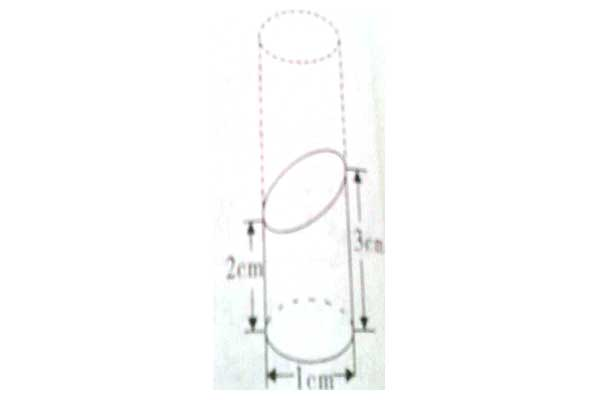

## 题型一

此题用相似三角形最简单，3/a=b/8，ab=24    但小学阶段就用上图方法为好。

---

## 题型二

---

## 题型三

如图将圆柱斜切一刀求体积。将圆柱补齐，所求图形的体积为高5cm圆柱体积的一半。

PS：可先用希沃白板画出图形，利用克隆等小工具展示拼接图形的过程。

参考：[六年级：巧求阴影部分面积](https://www.bilibili.com/video/BV1T94y1174i?spm_id_from=333.999.0.0&vd_source=cb4a6ad8978ef3ac986f741316ee2cc3)
