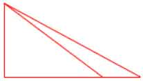

错题集：

+ 1.第一题第6小题。
  七巧板是由3种图形组成，其中有1个正方形，1个平行四边形，5个三角形。
  
+ 2.第一题第7小题。
  + ①要拼成一个大正方形至少需要4个完全相同的小正方形。
  + ②要拼成一个大正方体至少需要8个完全相同的小正方体。
  
+ 3.第一题第9小题。
  两个同样大小的直角三角形可以拼成一个长方形、三角形、平行四边形。
  
+ 4.判断题第1题。
  长方形对边相等，且四个角都是直角。有四条边只能说是四边形，不一定是长方形。
  
+ 5.判断题第2题。
  ~~只有两个同样大小的直角三角形才能拼成一个大三角形。~~（这种说法是错误的）
  
  
  
+ 6.判断题第3题。

+ 只有把一个等腰三角形对折才能得到两个完全相同的三角形。

+ 7.判断题第4题。
  将一张正方形纸对折两次，能折成4个正方形或者4个三角形。